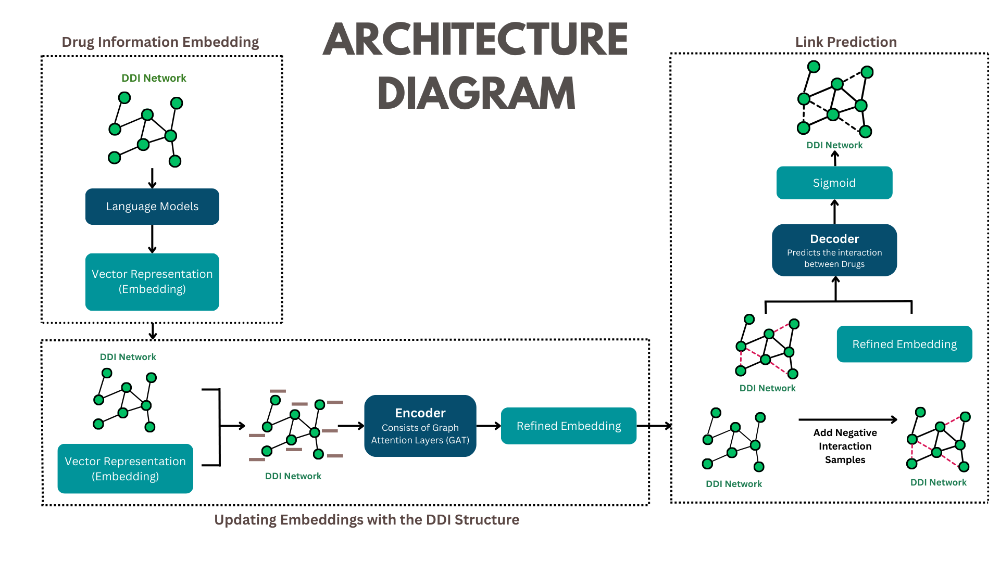
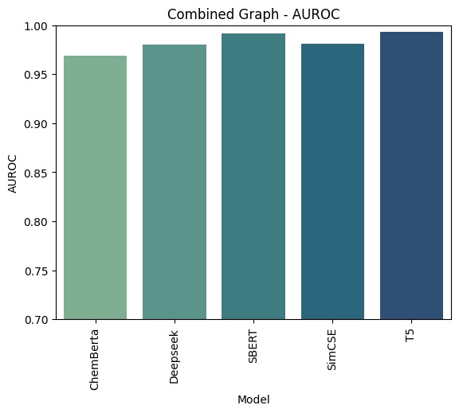
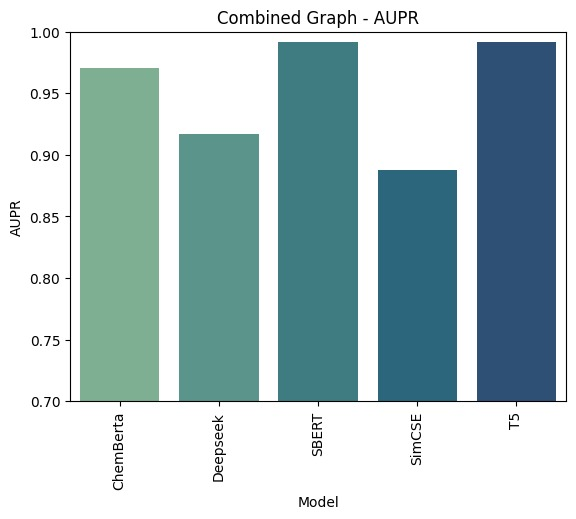
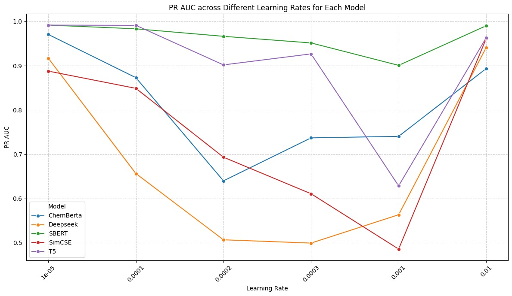
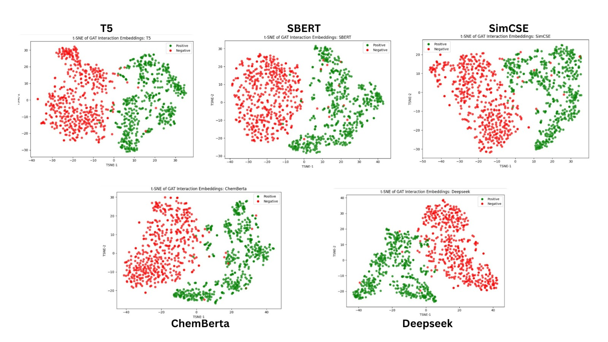

# GNN-Based Prediction of Drug-Drug Interactions Using Pretrained SMILES Embeddings

## Problem Statement
Due to the small numbers of participants in clinical studies, many DDIs remain undetected. Similarity-based computational methods struggle worth complex interactions. Traditional Graph Neural Networks (GNNs) do not prioritise pharmacologically relevant neighbours. The research gap consists of a lack of frameworks that combine molecular representation learning with graph structural context in a focused manner. Wet-lab DDI detection is time-consuming, costly, and limited in scale. A vast number of possible drug combinations makes exhaustive testing impossible. Use of SMILES-based molecular embeddings + Graph Attention Networks (GAT) enables advanced pattern recognition.
## Architecture Diagram
  

## DrugBank SMILES Dataset

We use two medication interaction databases that are considered the best: DrugBank and BioSNAP. DrugBank provides carefully structured pharmacological data andinformation regarding interactions between drugs, whileBioSNAP delivers additional drug-drug interaction insights obtained from chemical and clinical sources. To ensure consistency and chemical validity, we retrieve the SMILES (Simplified Molecular Input Line Entry System) strings for each drug and validate them using RDKit. Invalid or incomplete SMILES entries are filtered out. The remaining validated drugs are retained and form the node set for graph construction. Duplicate and noninteracting entries are removed to yield a high-confidence, connected interaction graph

| SMILES Data From DrugBank      | Count |
| ------------------------------ | ----- |
| Total Drugs in Dataset         | 12227 |
| Total SMILES in Dataset        | 12227 |
| Valid SMILES in Dataset        | 11574 |
| Removed Drugs in Dataframe     | 653   |

## Graph Construction

A heterogeneous, undirected graph is constructed where each node corresponds to a unique drug, and edges represent known drug–drug interactions from the merged DrugBank and BioSNAP datasets. We only keep medications that have valid embeddings and validated interaction edges. The final graph is converted into a format compatible with PyTorch Geometric, including the edge list and feature matrix. Every node consequently contains a vectorized embedding, while each edge signifies an interaction that needs to be predicted or validated. To pre-process the dataset for link prediction, we use Random Link Split, a process that splits the edges into training, validation, and test sets in a balanced way, representing positive and negative samples. Further, negative sampling is used in the training process to mimic unknown (non-interacting) drug pairs in order to increase the model’s discriminative ability.

| Dataset         | BioSnap | DrugBank | CombinedGraph |
| --------------- | ------- | -------- | ------------- |
| Number of Nodes | 1514    | 1706     | 1756          |
| Number of Edges | 48514   | 191402   | 198020        |
| Is Undirected   | True    | True     | True          |
| Isolated Nodes  | False   | False    | False         |
| Isolated Loops  | False   | False    | False         |
| Average Node Degree | 64.087 | 224.38  | 225.53        |

## Results

